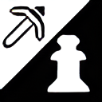
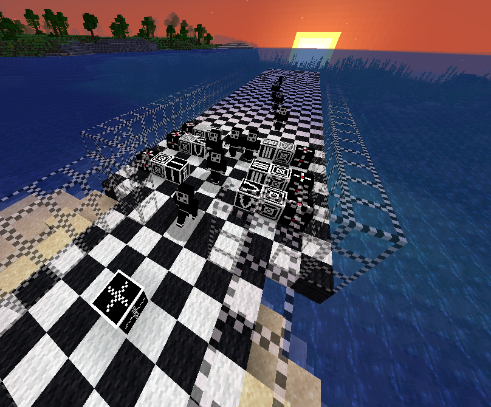
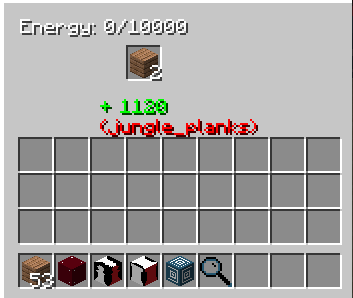
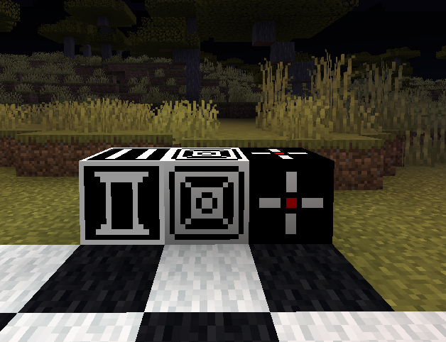
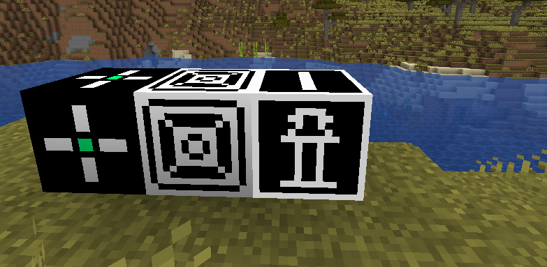

# ⛏️`Mine Defenders`♟️

## Tower Defense in Minecraft !

This mod brings a **whole new gameplay element** to Minecraft and much more with it
- **Automatic** and **efficient** base protection
- A **tiered system** based on the infamous chess pieces and their uses 

**Pawn** [Small Damage/Big delay] -> **Rook** [Medium Damage/Medium delay] -> **Bishop** [Impactful Damage/Small delay] -> **Queen** [Crazy Damage/Tiny delay]
- A point based **reward system**, the longer your king stays alive against the enemy, the wealthier you'll get. Points can be converted into **valuable** resources such as **diamonds** or **other mod items**.

Tower setup ready to defend the king from a wave of zombies

## The energy system (Generators)
Generators are the main way (for now) to generate energy and power the towers

## Towers
All the chess pieces have their own set of moves, the towers follow this principle in some way. Each of the four towers have different reach (boxes), reflecting how powerful/mobile the chess pieces are.

Typical tower setup

Tower GUI indicating energy held, tower owner's name and UUID

## Enemies
You'll have to defend yourself and your king from numerous enemies including fast moving ones, teleporting ones and much more, all aiming for the king !

An antiking

## As a whole

Typical chained setup

- The rightmost block is the **generator** (Minigenerator here, smallest generator available). Burning classic fuel items to generate power.

- The middle one is the **tower base**, it acts as the base for every tower (structurally and energy wise, no energy can flow between generators and towers). It can be seen as the white/black square on the chess board.

- The rightmost one is the **actual tower**, a Rook tower here (T2).

## Currently ✔️
- Towers (Pawn, Rook) ✔️
- Energy system (FE based) ✔️
- Generators (Minigenerator) ✔️
- Chess theme ✔️
- 3D Rendering of reach boxes for all towers ✔️

## TODOs ⚠️ / ❌
- All recipes ⚠️
- Javadoc ⚠️
- Higher tier towers and generators ⚠️
- Point based reward system ⚠️
- King to protect (Crystal or core in td games) ⚠️
- New monsters to fight ⚠️
- Player involved combat (Magic staff akin to Dungeon Defenders') ❌

### Heavily inspired by the original [Dungeon Defenders'](https://en.wikipedia.org/wiki/Dungeon_Defenders) [The King's Game ](https://dungeondefenders.fandom.com/wiki/The_King%27s_Game)map
