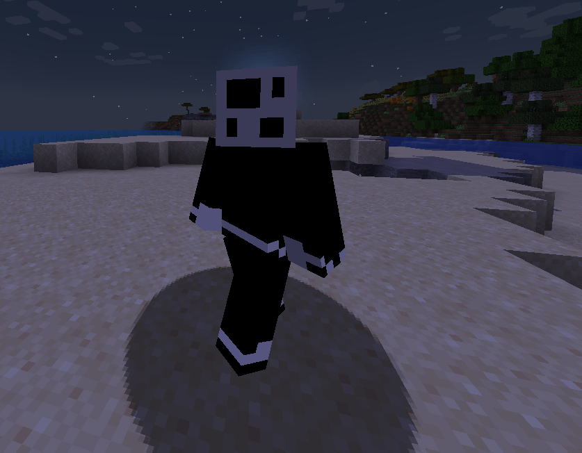

# ⛏️`Mine Defenders`♟️

## Tower Defense in Minecraft !

This mod brings a **whole new gameplay element** to Minecraft and much more with it
- **Automatic** and **efficient** base protection
- A **tiered system** based on the infamous chess pieces and their uses 

**Pawn** [Small Damage/Big delay] -> **Knight** [Impactful Damage/Medium delay] <-> **Bishop** [Medium Damage/Small delay] -> **Rook** [Impactful damage/Small delay] -> **Queen** [Crazy Damage/Tiny delay]
- A point based **reward system**, the more enemies you get rid of thanks to all of your tools (towers, staffs, relics), the more elo points you'll have. Points can be converted into **valuable** resources such as **diamonds** or **useful mod items**.

## The energy system (Generators)
Generators are the main way to generate energy and power the towers.
Generators exist in a tiered system:
- Soft Generator (T1, Small Generation/Capacity)
- Dense Generator (T2, Medium Generation/Capacity)
- Neutron Generator (T3, Big Generation/Capacity)

Plus ! A new kind of fuel has been developed for these new generators:
- Soft Coal
- Dense Coal
- Neutron coal

## Tower base
The middle man between the generator and the tower, transferring power at a flexible rate.

## Towers
All the chess pieces have their own set of moves, the towers follow this principle in some way. Each of the four towers have different reach (boxes), reflecting how powerful/mobile the chess pieces are. All the towers can drop their move so that you can craft their respective staff

## Staffs
Your towers won't be ones doing all the work, put some too with Tower staffs :
- Pawn staff (Small damage/reach, big cooldown)
- Knight staff (Big damage/Medium Reach, medium cooldown)
- Bishop staff (Medium damage/Big reach, medium cooldown)
- Rook staff (Big damage/Big reach, small cooldown)
- Queen staff (Crazy damage and crazy reach, tiny cooldown)

## Relics
Staffs have a cooldown and short range combat is difficult with them, introducing Relics:
- Sicilian Defense: Push your enemies away from your precious king
- Queen's Gambit: Deal big damage to your enemies, no knockback though
- King's March: Get rid of all of them, big damage and big knockback

From left to right : Sicilian Defense, Queen's Gambit and King's March

## Kings
This mod features two kings to defend:
- The black king, guard one lane and defend your king
- The white king, guard four lanes and be ready to give it your all !

Once placed, these blocks will build an arena where you will be able to place your towers under one rule : You cannot block the path of the enemies

While the king is in the world, you can use it to duplicate select few items given enough earned elo points.

## Enemies
You'll have to defend yourself and your king from numerous enemies including fast moving ones, teleporting ones and much more, all aiming for the king !

## Currently ✔️
- Towers (Pawn, Rook) ✔️
- Energy system (FE based) ✔️
- Generators (Minigenerator) ✔️
- Chess theme ✔️
- 3D Rendering of reach boxes for all towers ✔️
- All recipes ✔️
- Higher tier towers and generators ✔️
- King to protect (Crystal or core in td games) ✔️
- Player involved combat (Magic staff akin to Dungeon Defenders') ✔️
- Point based reward system ✔️

## TODOs ⚠️ / ❌
- Javadoc ⚠️
- New monsters to fight ⚠️

### Heavily inspired by the original [Dungeon Defenders'](https://en.wikipedia.org/wiki/Dungeon_Defenders) [The King's Game ](https://dungeondefenders.fandom.com/wiki/The_King%27s_Game)map
